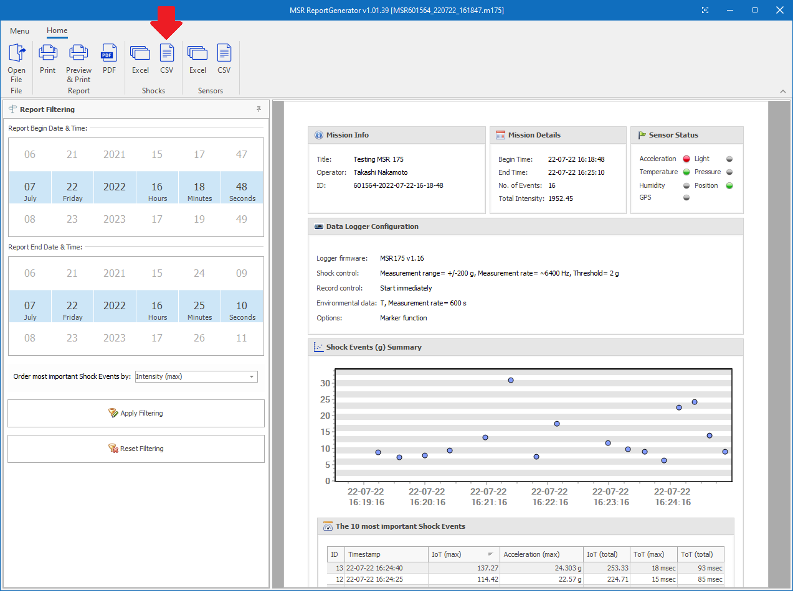

# Script to plot acceleration data recorded by MSR175

`plot-msr175.py` in this repository is a Python script to plot acceleration data recorded by [MSR175](https://www.msr.ch/en/product/transportation-shock-data-logger-msr175/).

## Prerequisite

 * Python 3.8 (or newer)
 * Numpy 1.23 (or newer)
 * matplotlib 3.1 (or newer)

## Usage

### 1. Download files from MSR175

Download files from [MSR175](https://www.msr.ch/en/product/transportation-shock-data-logger-msr175/) to your local computer using [MSR175 Dashboard software](https://www.msr.ch/media/pdf/Datalogger-MSR175-from-v1.08-Brief-instructions-EN.pdf). See [this video](https://www.youtube.com/watch?v=plT-Q1fBXyU) to learn how to download the files. The suffix of the downloaded files must be ".m175".

### 2. Generate CSV files

Double-click the downloaded .m175 file on Windows File Explorer to launch MSR Report Generator. Press "CSV" in "Shocks" category in the main tool bar of MSR Report Generator. It will ask you to select the directory in which the acceleration data are to be saved in CSV files. It will finally CSV files, ID-0.csv, ID-1.csv, etc., in the specified directory.

### 3. Run the script

Run `plot-msr175.py` with the CSV files as arguments:

    $ ./plot-msr175.py directory/to/ID-0.csv directory/to/ID-1.csv

The time series acceleration plots are generated. The file names of the plots are ID-0.png, ID-1.png, etc. They are generated under the same directory as the CSV files.

### 4. Options

Run `plot-msr175.py` with `--help` argument to see plot options:

    $ ./plot-msr175.py --help
