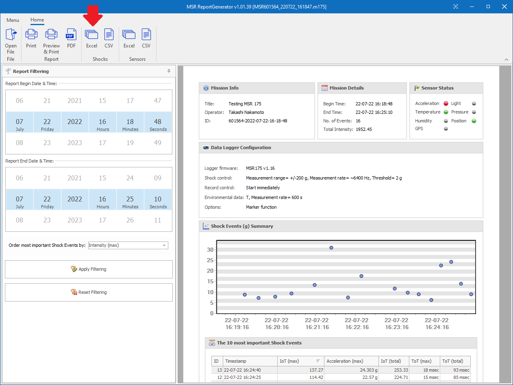
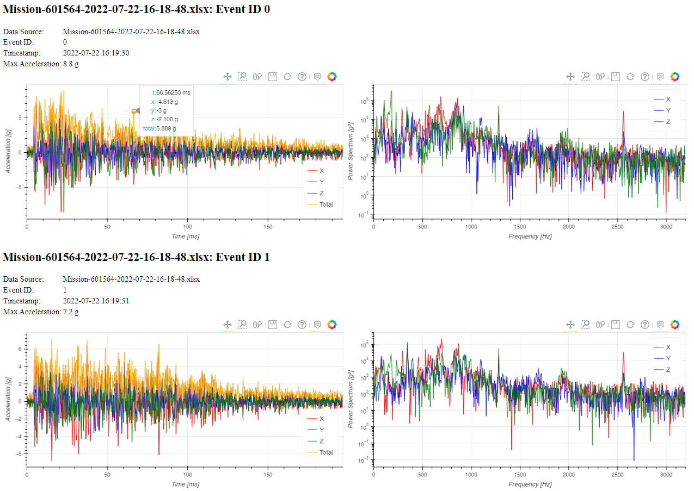

# Script to plot acceleration data recorded by MSR175

`plot-msr175.py` in this repository is a Python script to plot acceleration data recorded by [MSR175](https://www.msr.ch/en/product/transportation-shock-data-logger-msr175/).

## Prerequisite

You need to install the following software on your machine to run the script:

 * [Python](https://www.python.org/) 3.8.10
 * [BeautifulSoup](https://beautiful-soup-4.readthedocs.io/en/latest/) 4.11.1
 * [Numpy](https://numpy.org/) 1.23.1
 * [OpenPyXL](https://openpyxl.readthedocs.io/en/stable/) 3.0.10
 * [Bokeh](https://docs.bokeh.org/en/latest/) 2.4.3
 
Versions in the list above only indicate the versions that were used to develop and test the script. It is recommended to use those versions, but other versions might work.

If you already have a Python environment, you may install the Python packages above except Python itself with the command below:

    $ pip install beautifulsoup4 numpy openpyxl bokeh
    
## Installation

You do not need a special installation procedure. Just download everything in this repository, for example,

    $ git clone https://github.com/tnakamot/plot-msr175.git

## Usage

### 1. Download files from MSR175

First, you need to download files from [MSR175](https://www.msr.ch/en/product/transportation-shock-data-logger-msr175/) to your local computer using a USB cable and [MSR175 Dashboard software](https://www.msr.ch/media/pdf/Datalogger-MSR175-from-v1.08-Brief-instructions-EN.pdf). See [this video](https://www.youtube.com/watch?v=plT-Q1fBXyU) to learn how to download the files. The suffix of the downloaded files must be ".m175".

### 2. Generate Excel files

Double-click the downloaded .m175 file on Windows File Explorer to launch MSR Report Generator. Press "Excel" button in "Shocks" category in the main toolbar of MSR Report Generator. It will ask you to choose the directory and the file name. By default, the file name is `Mission-xxxxxx-yyyy-mm-dd-HH-MM-SS.xlsx` where `xxxxxx` is the serial number of the MSR175 and `yyyy-mm-dd-HH-MM-SS` is the date and time when you started the data logging with the MSR175. Once you enter the file name and press "Save" button, it generates an Excel file. You may open the Excel file and will notice that multiple shock events are recorded in one Excel file.

You may repeat the same procedure to generate an Excel file for each downloaded .m175 file.

### 3. Run the script

Run `plot-msr175.py` with the Excel files as arguments:

    $ ./plot-msr175.py path/to/Mission-aaaaaa-yyyy-mm-dd-HH-MM-SS.xlsx path/to/Mission-bbbbbb-yyyy-mm-dd-HH-MM-SS.xlsx ...

It will generate `output.html` in the current directory. Open it with your favorite Web browser, which should show the time series plots and power spectrum as below:

The plots are rendered by [Bokeh](https://docs.bokeh.org/en/latest/), which allows you to interacte with the plots in realtime. For example, you can zoom and pan to see more details that you are interested in. If you hover your mouse on the data points, the point data is shown.

| Note: You need to make sure that your machine has access to the Internet because the generated HTML uses the Bokeh JavaScript CDN. |
| --- |

### 4. Options

Run `plot-msr175.py` with `--help` argument to see plot options:

    $ ./plot-msr175.py --help

For example, you can change the output file name with `--output` option.

## License

The script is distributed under Apache-2.0 license. See [LICENSE](LICENSE) for more details.

## TODO

 * Document how to create/modify a template.

## Old version

There is a python script that reads CSV files (instead of the Excel files) and generates static plot images using matplotlib called as [plot-msr175-old.py](plot-msr175-old.py). This script is obsolete and no longer maintained because the CSV file generated by MSR Report Generator does not have metadata like event date or time and we migrated to the Excel files. If you still want to use the obsolete version, see [README_OLD.md](README_OLD.md).
