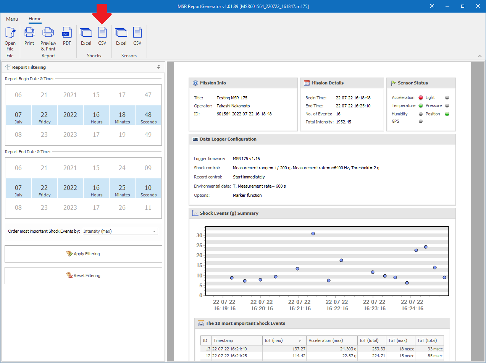

# Script to plot acceleration data recorded by MSR175

`plot-msr175-old.py` in this repository is a Python script to plot acceleration data recorded by [MSR175](https://www.msr.ch/en/product/transportation-shock-data-logger-msr175/).

## Prerequisite

 * Python 3.8 (or newer)
 * Numpy 1.23 (or newer)
 * matplotlib 3.1 (or newer)

## Usage

### 1. Download files from MSR175

First, you need to download files from [MSR175](https://www.msr.ch/en/product/transportation-shock-data-logger-msr175/) to your local computer using a USB cable and [MSR175 Dashboard software](https://www.msr.ch/media/pdf/Datalogger-MSR175-from-v1.08-Brief-instructions-EN.pdf). See [this video](https://www.youtube.com/watch?v=plT-Q1fBXyU) to learn how to download the files. The suffix of the downloaded files must be ".m175".

### 2. Generate CSV files

Double-click the downloaded .m175 file on Windows File Explorer to launch MSR Report Generator. Press "CSV" button in "Shocks" category in the main tool bar of MSR Report Generator. It will ask you to select a directory in which you want to save the CSV files. It will finally generate CSV files, ID-0.csv, ID-1.csv, etc., in the specified directory.

### 3. Run the script

Run `plot-msr175-old.py` with the CSV files as arguments:

    $ ./plot-msr175-old.py directory/to/ID-0.csv directory/to/ID-1.csv ...

Time series plots of the recorded acceleration will generated in the same directory as the CSV files. The file names will be ID-0.png, ID-1.png, etc.

### 4. Options

Run `plot-msr175-old.py` with `--help` argument to see plot options:

    $ ./plot-msr175-old.py --help

For example, you can change the file format of the plots with `--plot-format` option.

## License

The script is distributed under Apache-2.0 license. See [LICENSE](LICENSE) for more details.
